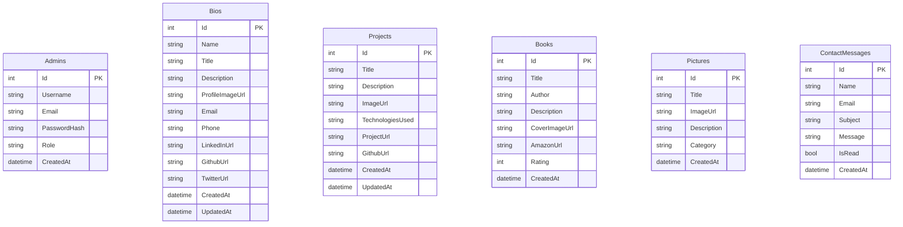

<div align="center">

# 🗂️ Portfolio APIs

**A secure, production-ready RESTful API backend for a developer portfolio website**

[](https://dotnet.microsoft.com/)
[](https://docs.microsoft.com/aspnet/core)
[](https://docs.microsoft.com/ef/core/)
[](https://www.microsoft.com/sql-server)
[](https://jwt.io/)
[](https://swagger.io/)
[](LICENSE)

---

*Manage your portfolio content — projects, bio, books, pictures & contact messages — through a clean, JWT-secured REST API with auto-generated Swagger docs.*

</div>

---

## 📑 Table of Contents

- [Overview](#-overview)
- [Tech Stack](#-tech-stack)
- [Architecture](#-architecture)
- [Database Schema](#-database-schema)
- [Authentication Flow](#-authentication-flow)
- [API Reference](#-api-reference)
  - [Auth](#auth-apiauthlogin)
  - [Bio](#bio-apibio)
  - [Projects](#projects-apiprojects)
  - [Books](#books-apibooks)
  - [Pictures](#pictures-apipictures)
  - [Contact](#contact-apicontact)
  - [Diagnostics](#diagnostics-apidiagnostics)
- [Getting Started](#-getting-started)
- [Configuration](#-configuration)
- [Deployment](#-deployment)
- [License](#-license)

---

## 🌟 Overview

**Portfolio APIs** is a backend service built with **ASP.NET Core (.NET 10)** that powers a developer portfolio website. It exposes a set of RESTful endpoints for managing portfolio content, handles JWT-based admin authentication, and comes with full **Swagger / OpenAPI** documentation served at the application root.

Key highlights:

| Feature | Details |
|---|---|
| 🔐 Authentication | JWT Bearer tokens with role-based (`Admin`) authorization |
| 📄 Documentation | Swagger UI served at `/` in all environments |
| 🗄️ Database | Microsoft SQL Server via Entity Framework Core (code-first migrations) |
| 🌐 CORS | Open policy for frontend clients |
| 🚀 Auto-migration | Migrations and admin seeding applied automatically on startup |

---

## 🛠️ Tech Stack

| Layer | Technology |
|---|---|
| Runtime | .NET 10 |
| Framework | ASP.NET Core Web API |
| ORM | Entity Framework Core 9 |
| Database | Microsoft SQL Server |
| Auth | JWT Bearer (`Microsoft.AspNetCore.Authentication.JwtBearer` 9.0) |
| Docs | Swashbuckle / Swagger UI 10 |
| Password Hashing | Custom `IPasswordHasher` service |

---

## 🏛️ Architecture

```mermaid
graph TD
    Client["🌐 Frontend / Client"]

    subgraph API["ASP.NET Core Web API"]
        direction TB
        MW["Middleware Pipeline\n(CORS → Auth → Authorization)"]
        CTRL["Controllers\n(Auth · Bio · Projects · Books · Pictures · Contact · Diagnostics)"]
        SVC["Services\n(IPasswordHasher · ITokenService)"]
        EF["ApplicationDbContext\n(Entity Framework Core)"]
    end

    DB[("🗄️ SQL Server")]
    SWAGGER["📄 Swagger UI\n(served at /)"]

    Client -->|"HTTP/HTTPS Requests"| MW
    MW --> CTRL
    CTRL --> SVC
    CTRL --> EF
    EF -->|"SQL Queries"| DB
    Client -->|"Browser"| SWAGGER
```



---

## 🗃️ Database Schema



---

## 🔐 Authentication Flow


---

## 📡 API Reference

> **Base URL:** `https://<your-host>/api`
>
> 🔒 = Requires `Authorization: Bearer <token>` header (Admin role)

### Auth — `/api/auth/login`

| Method | Endpoint | Auth | Description |
|--------|----------|------|-------------|
| `POST` | `/api/auth/login` | Public | Login and receive a JWT token |

**Request body:**
```json
{
  "username": "admin",
  "password": "your-password"
}
```

**Success response `200 OK`:**
```json
{
  "token": "<jwt>",
  "username": "admin",
  "email": "admin@example.com"
}
```

---

### Bio — `/api/bio`

| Method | Endpoint | Auth | Description |
|--------|----------|------|-------------|
| `GET` | `/api/bio` | Public | Retrieve the portfolio bio |
| `POST` | `/api/bio` | 🔒 Admin | Create the bio (only one allowed) |
| `PUT` | `/api/bio` | 🔒 Admin | Update the existing bio |

**Bio DTO fields:** `name`, `title`, `description`, `profileImageUrl`, `email`, `phone`, `linkedInUrl`, `githubUrl`, `twitterUrl`

---

### Projects — `/api/projects`

| Method | Endpoint | Auth | Description |
|--------|----------|------|-------------|
| `GET` | `/api/projects` | Public | List all projects (newest first) |
| `GET` | `/api/projects/{id}` | Public | Get a single project |
| `POST` | `/api/projects` | 🔒 Admin | Create a project |
| `PUT` | `/api/projects/{id}` | 🔒 Admin | Update a project |
| `DELETE` | `/api/projects/{id}` | 🔒 Admin | Delete a project |

**Project DTO fields:** `title`, `description`, `imageUrl`, `technologiesUsed`, `projectUrl`, `githubUrl`

---

### Books — `/api/books`

| Method | Endpoint | Auth | Description |
|--------|----------|------|-------------|
| `GET` | `/api/books` | Public | List all books (newest first) |
| `GET` | `/api/books/{id}` | Public | Get a single book |
| `POST` | `/api/books` | 🔒 Admin | Add a book |
| `PUT` | `/api/books/{id}` | 🔒 Admin | Update a book |
| `DELETE` | `/api/books/{id}` | 🔒 Admin | Delete a book |

**Book DTO fields:** `title`, `author`, `description`, `coverImageUrl`, `amazonUrl`, `rating`

---

### Pictures — `/api/pictures`

| Method | Endpoint | Auth | Description |
|--------|----------|------|-------------|
| `GET` | `/api/pictures` | Public | List all pictures (optional `?category=` filter) |
| `GET` | `/api/pictures/{id}` | Public | Get a single picture |
| `POST` | `/api/pictures` | 🔒 Admin | Upload a picture entry |
| `PUT` | `/api/pictures/{id}` | 🔒 Admin | Update a picture entry |
| `DELETE` | `/api/pictures/{id}` | 🔒 Admin | Delete a picture entry |

**Picture DTO fields:** `title`, `imageUrl`, `description`, `category`

---

### Contact — `/api/contact`

| Method | Endpoint | Auth | Description |
|--------|----------|------|-------------|
| `POST` | `/api/contact` | Public | Submit a contact message |
| `GET` | `/api/contact` | 🔒 Admin | List all contact messages |
| `GET` | `/api/contact/{id}` | 🔒 Admin | Get a specific message |
| `PUT` | `/api/contact/{id}/read` | 🔒 Admin | Mark message as read |
| `DELETE` | `/api/contact/{id}` | 🔒 Admin | Delete a message |

**Contact DTO fields:** `name`, `email`, `subject`, `message`

---

### Diagnostics — `/api/diagnostics`

Health-check and diagnostic endpoints (public) used to verify connectivity and runtime status.

---

## 🚀 Getting Started

### Prerequisites

- [.NET 10 SDK](https://dotnet.microsoft.com/download)
- [SQL Server](https://www.microsoft.com/sql-server) (LocalDB, Express, or full edition)

### 1. Clone the repository

```bash
git clone https://github.com/ZainulabdeenOfficial/Portfolio-Apis.git
cd Portfolio-Apis/portfilo
```

### 2. Configure the application

Copy the template and fill in your values:

```bash
cp portfilo/appsettings.template.json portfilo/appsettings.json
```

Edit `appsettings.json` — see the [Configuration](#-configuration) section for details.

### 3. Apply database migrations

```bash
dotnet ef database update --project portfilo
```

> Migrations are also applied automatically on application startup.

### 4. Run the API

```bash
dotnet run --project portfilo
```

The Swagger UI will be available at **`http://localhost:<port>/`**.

---

## ⚙️ Configuration

All settings live in `appsettings.json` (never commit this file — it is git-ignored):

```jsonc
{
  "ConnectionStrings": {
    // SQL Server connection string
    "DefaultConnection": "Server=(localdb)\\MSSQLLocalDB;Database=portfilodb;Trusted_Connection=True;TrustServerCertificate=True;"
  },
  "Jwt": {
    "Key": "<min-32-char secret key>",   // Used to sign JWT tokens
    "Issuer": "PortfolioAPI",
    "Audience": "PortfolioClient"
  },
  "DefaultAdmin": {
    "Username": "<admin-username>",      // Seeded automatically on first startup
    "Email": "<admin-email>",
    "Password": "<secure-password>"
  }
}
```

> ⚠️ **Security note:** Use a strong, randomly generated value for `Jwt:Key` (at least 32 characters). Never hardcode credentials in source control.

---

## ☁️ Deployment

The project includes a publish profile for **Azure App Service** (`Properties/PublishProfiles/`). General steps:

1. Set environment variables (or App Service Configuration) for all `appsettings.json` values.
2. Point `DefaultConnection` to your production SQL Server / Azure SQL instance.
3. Deploy using the publish profile or a CI/CD pipeline.
4. The application will automatically run migrations and seed the default admin on first start.

---

## 📄 License

This project is licensed under the **MIT License** — see the [LICENSE](LICENSE) file for details.

---

<div align="center">

Made with ❤️ by [ZainulabdeenOfficial](https://github.com/ZainulabdeenOfficial)

</div>